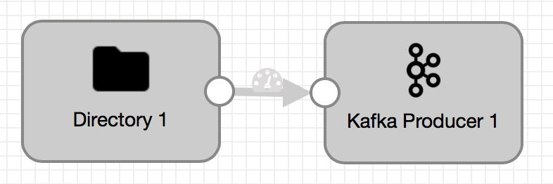
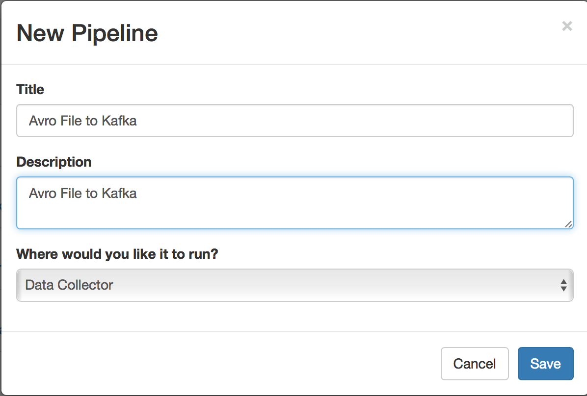
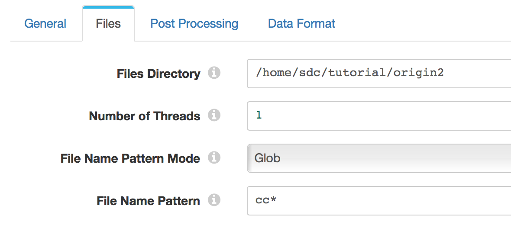
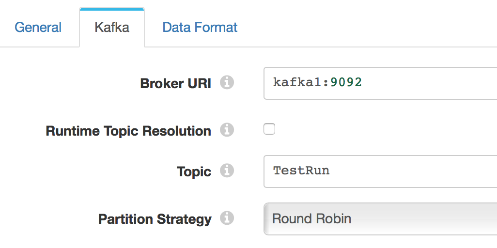
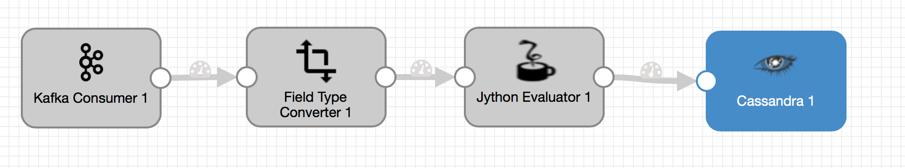
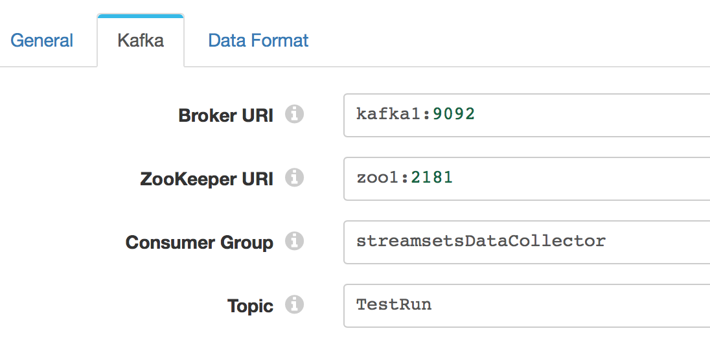
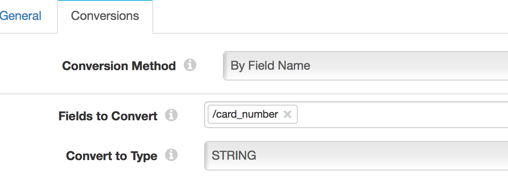
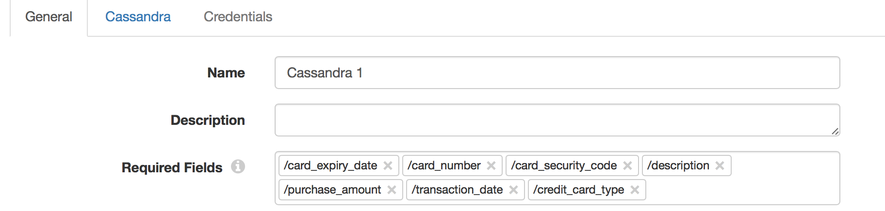
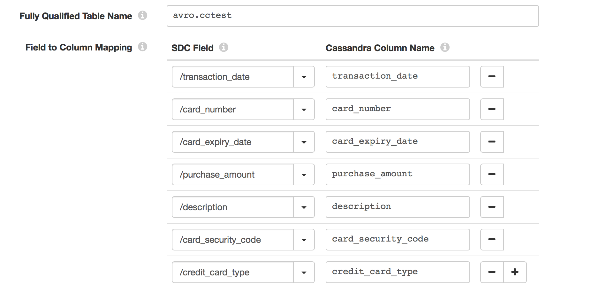

# Streaming from Kafka to DataStax with StreamSets
Provides a quick-start example of streaming data from Kafka to DataStax Enterprise (DSE) with StreamSets Data Collector.

upgraded to DataStax 6.7
upgraded to use latest Wurstmeister images

## Overview
In this tutorial, the StreamSets Data Collector is used to create streaming data pipelines to write to/from Kafka and ultimately landing in DSE.  The high-level architecture is shown in the following diagram:


## Requirements

1. Docker engine (Free CE version works fine https://www.docker.com/community-edition)
## Getting Started
1. Pull this github repo into `datastaxStreamsetsDocker` directory  
    ```bash
    git clone https://github.com/jatin7/dse_streamsets_docker.git
    ```
2. `cd dse_streamsets_docker`
3. Start docker containers with `docker-compose up -d`
4. Wait 1 minute for containers to startup
5. Verify DataStax is up-and-running (again, see previous step, this may take a minute or two for Docker images):
```bash
docker exec dse cqlsh dse -u cassandra -p cassandra -e "desc keyspaces";
```
6. Create keyspace and table in DSE:
```bash
docker cp src/create_table.cql dse:/opt/dse;
docker exec dse cqlsh dse -f /opt/dse/create_table.cql
```
7. Verify table exists:
```bash
docker exec dse cqlsh dse -e "desc avro.cctest"
```
8. Create the directory and add the avro source file to the StreamSets Data Collector
```bash
docker cp src/data/ccsample streamdc:/home/sdc/tutorial/origin2;
```

## Add Additional Libraries to Stage Libraries section

The package manager makes stage libraries available to pipelines.  The following three stage libraries need to be added for the subsequent pipelines.

1. Login to StreamSets Data Collector at http://localhost:18630 with username: admin password: admin
2. Click on *Package Manager* icon 
3. Select Apache Kafka version (2.0.0 for example)
4. click the ellipsis buttons and select install
5. On Install Stage Library, click cancel
6. log back in to StreamSets Data collector
7. Select latest *Jython* and install (click cancel on Install Stage Library)
8. Select latest *Cassandra Java Driver* and install (click cancel on Install Stage Library)
9. restart streamsets container to make the drivers usable 
```bash
docker restart streamdc
```


## Running and Creating StreamSets Pipelines

At this point, you have a choice between two options: Easy and Advanced.  Easy way is to import pre-configured pipelines and run.  Advanced approach is manual creating the pipelines and then running.  

### Easy - Get things running as fast as possible

The following screencast shows what we're going to do.  See below for step-by-step instructions.


The steps shown in the above screencast (starting at "Get Started" blue screen)

1. Login to StreamSets Data Collector at http://localhost:18630 with username: admin password: admin
2. Import the `exports/Kafka Consumer to DSE.json` pipeline and start
3. Import the `exports/Files to Kafka.json` pipeline and start
4. Verify data has landed in DSE from terminal with `docker exec dse cqlsh dse -e "select * from avro.cctest limit 10"`

That's it.  Easy button.

Note: if you start/stop pipelines in the future.  You will likely need to "Reset Origin" of both pipelines.  Please consult StreamSets documentation for more information around resetting pipeline origins.

### Advanced - Create the pipelines manually

StreamSets pipeline documentation can be found here:

[https://streamsets.com/documentation/datacollector/latest/help/index.html#datacollector/UserGuide/Pipeline_Design/What_isa_Pipeline.html](https://streamsets.com/documentation/datacollector/latest/help/index.html#datacollector/UserGuide/Pipeline_Design/What_isa_Pipeline.html)

A pipeline describes the flow of data from the origin system to destination systems and defines how to transform the data along the way.

We will have a pipeline to pull data from an avro file and add it to kafka.  Then, a second pipeline will pull data from kafka and write to DataStax Cassandra

## Open up the StreamSets Data Collector Interface

* Bring up the StreamSets Data Collector from the browser with localhost:18630 using **admin** as both the username and the password

## Create Kafka producer pipeline

When completed, the pipeline will look like this:


### Creating a Pipeline

* Create a new Pipeline by clicking the **Create New Pipeline** button to bring up the New Pipeline dialog box.  Enter a Title and Description for the Pipeline and click **Save**.

### Defining the Source
* Drag the **Directory** origin stage into your canvas.
* In the Configuration settings below, select the **Files** tab.
* Enter the following settings:

 * **Files Directory** - The absolute file path to the directory containing the sample .avro files.
 * **File Name Pattern** - `cc*` -
 *The ccdata file in the samples directory is a bzip2 compressed Avro file.*  Data Collector will automatically detect and decrypt it on the fly.

In the data format tab, choose Avro.

* In the **Post Processing** tab make sure **File Post Processing** is set to None.

*Note: The Avro files already contain the schema that the origin will pick up and decode on the fly. If you'd like to override the default schema, enter the custom schema in the Avro tab.*


### Defining the Kafka Producer

1. Drag a **Kafka** Producer Destination to the canvas and connect the Directory to the Kafka Producer
2. Click on the Kafka Producer.  
3. On the General Tab, set the Stage Library version to **Apache Kafka 2.0.0.  Go to the Kafka tab and set the Broker URI property to point to your Kafka broker e.g.`kafka1:9092`. Set Topic to the name of your Kafka topic (TestRun).  Finally, the set Data Format to SDC Record.

4. In the **Data Format** tab, choose SDC Record
*SDC Record is the internal data format that is highly optimized for use within StreamSets Data Collector (SDC). Since we are going to be using another Data Collector pipeline to read from this Kafka topic we can use SDC Record to optimize performance. If you have a custom Kafka Consumer on the other side you may want to use one of the other data formats and decode it accordingly.*
5. Click on the pipeline canvas, got to the **Error Records** tab, choose to discard the error messages

The pipeline is now ready to feed messages into Kafka.

#### Preview the Data
* Feel free to hit the Preview icon to examine the data before executing the pipeline.

#### Execute the Pipeline
* Hit the Start icon. If your Kafka server is up and running, the pipeline should start sending data to Kafka.  Watching the metrics, 10,000 rows should go to the producer.  Stop the pipeline using the red stop rectangle.  To rerun at a later time, make sure to **reset origin** (under the ellipsis) to restart the load from the beginning.

## Create Kafka Consumer

Once stage properties are added, the pipeline will look like this:


1.  Create another New Pipeline **Kafka to Cassandra**
2.  Add the **Kafka** consumer origin to the canvas
3.  Under the General tab, select **Apache Kafka 0.11.0.0** for the **Stage Libary**.  Provide the following information under the **Kafka** tab of the **Kafka** origin.

Choose SDC Record under the Data Format tab
4. Add the **Processor** called **Field Type Converter** to the Pipeline and connect it to the Kafka Consumer
5. For the Field Type Conversion, add the following conversion type information
6. Add the **Processor** called **Jython Evaluator** and connect it to the **Field Type Converter**
7. In the **Jython** tab of the **Jython Evaluator**, in the **Script** section, enter the following code
```python
for record in records:
  try:
    cc = record.value['card_number']
    if cc == '':
      error.write(record, "Credit Card Number was null")
      continue

    cc_type = ''
    if cc.startswith('4'):
      cc_type = 'Visa'
    elif cc.startswith(('51','52','53','54','55')):
      cc_type = 'MasterCard'
    elif cc.startswith(('34','37')):
      cc_type = 'AMEX'
    elif cc.startswith(('300','301','302','303','304','305','36','38')):
      cc_type = 'Diners Club'
    elif cc.startswith(('6011','65')):
      cc_type = 'Discover'
    elif cc.startswith(('2131','1800','35')):
      cc_type = 'JCB'
    else:
      cc_type = 'Other'

    record.value['credit_card_type'] = cc_type
    output.write(record)

  except Exception as e:
    # Send record to error
    error.write(record, str(e))
```
8. Add the **Destination** called **Cassandra Java Driver** and connect it to the **Jython Evaluator**
9. Add the following **Required Fields** in the Cassandra Destination General Tab (without this step the pipeline will not populate Cassandra)

10. In the Cassandra Destination **Cassandra** Tab:  
  * Add **dse** as the contact point
  * V4 as the protocol version

11. Click on the pipeline canvas, got to the **Error Records** tab, choose to discard the error messages
12. Start both of the pipleines (start **Kafka to Cassandra** before starting **Avro to Cassandra**).  If records don't flow, try stopping, resetting the origin, and starting the **Avro to Kafka** pipeline while leaving the **Kafka to Cassandra** pipeline running
13. Ensure Data flowed into the cassandra table
```bash
docker exec dse cqlsh dse -e "select * from avro.cctest"
```

## Completed!


## Further Reference

* DataStax Docker Images
[https://github.com/datastax/docker-images/#datastax-platform-overview](https://github.com/datastax/docker-images/#datastax-platform-overview).

* [StreamSets Data Collector](https://streamsets.com/)

* [StreamSets Docker Images](https://github.com/streamsets/datacollector-docker.git)

* Test data came from a StreamSets tutorial github but I have copied the data into this github.
 [https://github.com/streamsets/tutorials/blob/master/sample_data/](https://github.com/streamsets/tutorials/blob/master/sample_data/)
